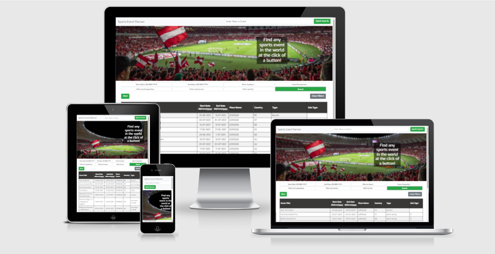

# 'Sports Event Planner' website

## Introduction

This website is aimed at sports fans looking for events attend anywhere in the world. Any team, any competition, any sport or any event, in any country in the world can be located in seconds and the details displayed on screen at the click of a button.  

A live website can be found [here]( https://andyb-whg.github.io/sports-event-planner/).

# Table of Contents
- [1. UX](#ux)
  * [1.1. Strategy](#strategy)
    - [Project Goals](#project-goals)
    - [User Stories:](#user-stories)
    - [Strategy Table](#strategy-table)
  * [1.2. Structure](#structure)
  * [1.3. Skeleton](#skeleton)
  * [1.4. Surface](#surface)
- [2. Features](#features)
- [3. Technologies Used](#technologies-used)
- [4. Testing](#testing)
- [5. Development Cycle](#development-cycle)
- [6. Deployment](#deployment)
- [7. End Product](#end-product)
- [8. Known Bugs](#known-bugs)
- [9. Credits](#credits)

# 1. UX
  [Go to the top](#table-of-contents)

## 1.1. Strategy
  [Go to the top](#table-of-contents)

### Project Goal

The main aim of the site is to give users a super-efficient way to locate an event or potential range of sports events, at the click of a button, to help plan a trip.

### User Stories:
 * As a user I want a simple, quick method of finding an event to attend.

 * As a user I want the page to be intuitive and easy to understand.  

 * As a user I want the site to tell me if I’m doing something wrong and how to fix it.  

 * As a user I want the site to be elegant and easy on the eye.

 * As a user I want the site to be responsive to different screen sizes so that I can still use the site whether I’m using my mobile phone, tablet or PC.

 * As a user I want the more advanced ‘filter’ options to be simple, obvious and intuitive to use.

 * As a user I want the results returned to be informative, concise, easy to view and read and relevant to my search request.

### Strategy Table
Features| Importance| Viability/Feasibility
------------ | -------------------------|---------
Provide a list of scheduled events | 5 | 5
Quick Search function  | 5| 5
Filter Buttons to narrow search parameters | 5 | 5
Responsive design | 5 | 5
Google Map showing location/s of listed results | 4 | 3
Hotels / Restaurants Section beneath map when map location clicked | 4 | 2

## Scope

It is unlikely that all of the features listed above can be implemented in time for initial deployment. The site will therefore be developed in three stages:

### Stage 1

The initial basic site takes user inputs and provides a table of up to ten events, in date order, for the user to view.  Pagination buttons allow the user to view additional results should the list returned be greater than 10 items.

### Stage 2

A google map is to be added in stage 2 with the locations of the listed events marked on the map.

### Stage 3
Details of restaurants, hotels and places of interest to be added below the map enabling users to better plan the trip and improve the travel experience.

## 1.2. Structure
  [Go to the top](#table-of-contents)

 - Site to be responsive on all Screen Sizes with information selectively added / removed dependent upon the screen size in use.
 - ‘Nav Bar’ section placed prominently at the top of the page to act as an initial prompt for first time visitors.
 - Hero image of a sports event beneath the Quick Search section, with a ‘Call Out’ describing and explaining exactly what the site does for the user.
 - ‘Filter Section’ provided beneath the Hero Image. Placed lower down the page to prevent distractions for new users.  Returning and frequent users will be acquainted with the site and thus more confident to move beyond the basic Nav Bar search option.
 - A ‘Results Table’ is displayed beneath the filter section, initially listing the current most prestigious upcoming events across the world.  The table to display ten results at a time, with ‘pagination buttons’ provided should a search bring back more than ten events.
 - ‘Google Map’ (Stage 2 development) to be listed below the Results Table marking the listed event locations on the map.  
 - ‘Local Attractions’ (Stage 3 development) to be listed beneath the Google Map.  
 - Footer section at bottom of page displaying social media links to various websites including Twitter, Youtube, Instagram and Facebook.

## 1.3. Skeleton
  [Go to the top](#table-of-contents)

[Balsamiq](https://balsamiq.com/) was used to create the following wireframes.  
Three variations are provided as examples of differing screen size layouts, namely Mobile, Tablet and Desktop. 'Extended' versions of the mobile and tablet wireframes are provided in order to show the full scrollable content post Stage 3. 

### Wire-frames
Web browser view

Mobile & Tablet browser view

## 1.4. Surface
  [Go to the top](#table-of-contents)

### Colours
Colours used are:

- #28a745 (Green) - used on buttons to compliment the grass within the Hero Image.
- #393837 (Charcoal Grey) - implemented within the Table Header to blend with the Filter and Table text and to tie in with the darker section of the Hero Image but with a softer shade to be easier on the eye.  Also provides a clear differentiation between the filter and table sections.

### Typography
- 'Exo' : used on the majority of the site to provide a mordern, positive feel.
- 'Play' : Filter Button font to provide contrast and interest against the Table section.

# 2. Features
  [Go to the top](#table-of-contents)

### Header Section
- Company Brand - placed prominently at top left.
- Quick Search Input Box - prompts users to search for a team or competition of interest.  Aids first time visitors providing an easy, intuitive first step.
- Quick Search button - highlighted in green for subconscious positive affirmation of use.
- Loading GIF - appears during initial page load whilst suggestions are loaded from the linked API - suggestions then populate the Quick Search Input Box to help the user with potential searches.

### Hero Image Section
- Emotive atmospheric image of a packed sports stadium used to invoke positivity, excitement and urgency.
- 'Call-Out' message both informs the user of the website's purpose whilst promoting immediate action.

### Filter Section

* Seven filter buttons provide the ability to narrow and refine searches between  :
  - Start Date
  - End Date
  - Sport
  - Team / Competitor
  - Competition
  - Country

* 'Start Filter' button - coloured green as per the Quick Search button to indicate positive use. Takes the input from the seven Filter Buttons and feeds the requirements to the 'PredictHQ' external API resource.

### Results Table Section

- Seven Columns provide pertinent information to the user based on the search criteria provided :
  - Event Title 	
  - Start Date 
  - End Date
  - Place Name	
  - Country	
  - Type	
  - Sub Type

- Results are provided 10 rows at a time.
- Pagination buttons are provided where the results yielded number greater than ten.  The user is able to move backwards and forwards as required.
- Each line is highlighted in green as per the previous buttons, both to standardise the colour scheme and, for Developments Stages 2 and 3, to indicate that the line can be clicked to highlight and zoom in on the Google Map location.
- 'Clear Filter' button : provides a simple, quick method to clear the filters ready for a subsequent search.

### Footer / Social Media Section

The bottom of the page provides standard / expected social media links to popular platforms including Youtube, Twitter, Facebook and Instagram.

# 3. Technologies Used
  [Go to the top](#table-of-contents)

- [HTML5](https://developer.mozilla.org/en-US/docs/Glossary/HTML5), [CSS3](https://en.wikipedia.org/wiki/CSS) and [Boostrap v.4.1](https://getbootstrap.com/docs/4.1/getting-started/introduction/) provide structure, styling and responsiveness to various viewports. 

- [Balsamiq](https://balsamiq.com/) wireframes were used in the design and initial look of the site.

- [Javascript](https://en.wikipedia.org/wiki/JavaScript) and [jQuery](https://en.wikipedia.org/wiki/JQuery) enable the site's user-interactivity functions.

- The [PredictHQ.com](https://www.predicthq.com/?utm_campaign=Brand&utm_term=predicthq&utm_source=adwords&utm_medium=ppc&hsa_net=adwords&hsa_ver=3&hsa_grp=21054631146&hsa_tgt=kwd-922375241988&hsa_kw=predicthq&hsa_cam=339807546&hsa_ad=494263849564&hsa_src=g&hsa_acc=4773278510&hsa_mt=e&gclid=Cj0KCQjw_dWGBhDAARIsAMcYuJwqJuYQFVJoJ-D3d468HtAhRv5UgC78H6AQUcCC39L1yzf9OI8ZV-AaAt6TEALw_wcB) 'Events' and 'Places' API's provide the real-time data powering the Search and Results Table features.

- The [Chrome](https://www.google.com/intl/en_uk/chrome/) web-browser was used to view and test the site through design and implementation.

- The [Gitpod](https://www.gitpod.io/) IDE (integrated development environment) and [Github](https://github.com/Github) repository provided the platforms for developmernt and storage of the site.

- [Google Fonts](https://fonts.google.com/) provided the 'Exo' and 'Play' fonts utilised within the site.

# 4. Testing
  [Go to the top](#table-of-contents)

## Automated testing

Screen responsiveness testing was carried out using Google Chrome's Developer Tools to ensure correct page loading on multiple devices including various mobile phone and tablet sizes.

### W3C Validator Tools

[W3C HTML Validator](https://validator.w3.org/) tool used to validate HTML code.

[W3C CSS Validator](https://jigsaw.w3.org/css-validator/) tool used to validate CSS style code.

[JS Hint](https://jshint.com/) used to verify Javascript coding (is unable to verfiy jQuery sections however).

## Manual Testing

* Site loads as expected on both Motorola and Sony mobile phone devices utilising the Android operating system, running the Chrome browser. 

* Site loads as expected on a PC utilising the Windows operating system.  Tested using Chrome, Firefox and Edge.  All load correctly and function identically.  On the Edge browser, however, the final column renders without any outline styling on those lines where the content is empty.  Does not affect functionality in any but doesn't look quite as nice as the Chrome/Firefox rendering.

* Site loads as ecpected on an 2016 iPad Mini utilitsing the Safari browser. The table results do not highlight green when tapped as per newer devices however. This may be due to the age of the operating system so needs investigation.

* Responsiveness :
  - The site is responsive to all break points and works as expected.
  
* Quick Search Input Box : 
  - 'Loading' message is replaced with prompt to type a team or competition as expected.  
  - Box loads with 250 event suggestions as expected. User can type as required, and either select from the filtered/remaining options or ignore as desired.

* Quick Search button :
  - Button works as expected. Results are retrieved from the API and displayed in a table between the filter and footer sections of the page.

* Filter buttons :
  - 'Start Date' button - tested and works as expected.
  - 'End Date' button - tested and works as expected.
  - 'Filter by Sport' button - when tested, this button works when used in conjunction with other search criteria but does not work by itself.  Time constraints have left the bug unresolved for the time being.  The button does load preset sport options as designed, from which the user can select/ignore/type their own input.
  - 'Team/Competitor' button - tested and and is not working at present. Time constraints have left the bug unresolved for the time being. Bug is suspected to be related to the 'search' string submitted to the API and is likely to be the same bug affecting the 'Filter by Competition' and 'Filter by City' buttons.
  - 'Filter by Competition' button - tested and is not working at present. Time constraints have left the bug unresolved for the time being.
  - 'Filter by Country' - tested and works as expected.  Preset country options load as designed, from which the user can select/ignore/type their own input.
  - 'Filter by City' - tested and is not working at present. Bug is suspected to be related to the 'search' string submitted to the API and is likely to be the same bug affecting the 'Team/Competition' and 'Filter by Competition' buttons.
  - 'Start Filter' - functions as expected. When clicked, the working search parameters are retrieved from the API and dsplayed in a table below the filter buttons.

- Table rows
  - Individual events highlight in green when selected on a touch screen or hovered over using a mouse.  Tested on a 2016 Apple iPad mini but this functionality was not present - possibly due to the age of the platform.

* Footer Links :
  
    - Facebook - When selecting the Facebook icon, a new tab opens and redirects to the Facebook website. It worked as expected.
    - Twitter -  When selecting the Twitter icon, a new tab opens and redirects to the Twitter website. It worked as expected.
    - YouTube - When selecting the YouTube icon, a new tab opens and redirects to the YouTube website. It worked as expected.
    - Instagram -  When selecting the Instagram icon, a new tab opens and redirects to the Instagram website. It worked as expected.

# 5. Development Cycle
  [Go to the top](#table-of-contents)

There were many elements I changed, re-positioned and added from my original wireframes as they were more visually appealing.

### All pages:
 - Replaced the Sir Alex Photo on the top right with just a text. This is visually more appealing because the text can fit inside the navigation bar.

### Landing page:
  - The original wireframe lacked attention from users. I added an embedded YouTube video to make the user more variety with different media elements. This video is also a short introduction to what the website is about.

### Career page:
  - I added a statistics panel to show the numbers Sir Alex achieved during his career.
  - The original design shows the timeline is continuously on the left side of the page. I decided to change this to make the timeline appear on the centre of the page with the content displaying on the left then the right side of the page. This keeps the user engaged as the content isn't just a block of text.

### Testimonials page:
  - The original wireframe shows this page as an awards page with the same timeline design as the career page however, I changed this to a testimonials page. This is to give the user a better experience with a different format from the career page. As I was planning to use the same design the user would have been less engaged as they felt like they were reading the same content in the same format.
  - I added in a cards view, this gives the user smaller amounts of content so it's easy to process. The image on each card also gives the context of who the quote was from.

### Gallery page:
  - The gallery page has remained the same. I added a hover animation over each photo to give the context of what the image is about.

### Contact page:
 - After coding the contact page to the original design. I thought that it looked dull, so I added other elements to make this page visually appealing to the users.
 - Added google maps location
 - Added icons for location, telephone number and contact email.

# 6. Deployment
  [Go to the top](#table-of-contents)

I used GitHub pages to deploy my final project. To do this I had to:

1. Create a repository on GitHub.
2. Clone the repository on your chosen source code editor (Atom in my case) using the clone link.
4. Add files to Git (staging area) and use the atom commit to master button.
5. Use git within atom to push the code.
7. Go to GitHub and load your repository.
8. Select settings.
9. Select pages on the left menu bar.
10. Click on the master branch.
11. This will now generate a link with your website live.

# 7. End Product
  [Go to the top](#table-of-contents)

  Please fine below a screenshot of each page:

  Home page UI:
  

  Career page UI:
  

  Testimonials page UI:
  

  Gallery page UI:
  

  Contact page UI:
  

# 8. Known Bugs
  [Go to the top](#table-of-contents)

  - On some mobile devices the navigation bar appears behind the content. This was rectified by adding a z-index to the CSS for the navigation bar.
  - My first implementation of the navigation bar was not responsive on mobile devices, meaning that the design was floating off the screen. This was rectified by implementing a new navbar that included a hamburger style button when the screen size gets smaller.
  - The form styling on some mobile devices do not match the web styles. This was rectified by adding WebKit appearance, appearance in the CSS and set the value to none.
  - The video on the home page was not responsive. This was fixed by adding a height value in the CSS in smaller media queries.
  - The managerial career stats section was also not responsive. This was fixed by adding a smaller font-size value to the media query of max-width 635px. This allowed the whole section to be visible on mobile devices.

# 9. Credits
  [Go to the top](#table-of-contents)

### Code

* https://www.codeinwp.com/blog/fetch-api-tutorial-for-beginners/  :  main resource used whilst writing API Fetch() methods. 
* https://css-tricks.com/using-fetch/  :  General coding advice and specific advice on handling Fetch() errors. 
* https://gomakethings.com/how-to-use-the-fetch-method-to-make-multiple-api-calls-with-vanilla-javascript/  :  further info regarding nesting Fetch methods.
* https://learn.co/lessons/javascript-fetch  :  website suggested by CI tutor on the subject of the Fetch() method.
* https://developer.mozilla.org/en-US/docs/Web/API/Fetch_API/Using_Fetch#body  :  a second website suggested by CI tutor on the subject of the Fetch() method.
* https://www.w3schools.com/ :  general advice regarding JavaScript syntax.
* https://jqueryui.com/autocomplete/  :   for basic coding in relation to the 'Autocomplete' function used to display potential selection options in the 'Quick Search' input box (Nav Bar section).

### Content
* API data :  https://www.predicthq.com/
* Hero image provided by Riciardus from Pexels  :  [Stadium Image](https://www.pexels.com/photo/green-and-white-soccer-field-at-night-time-41257/)
* Header picture of four devices for this README.md document  : [Am I Responsive](http://ami.responsivedesign.is/)
* 'Social Media' icons in the footer section   :  [Font Awesome](https://fontawesome.com/)
* README.md layout/template provided by a fellow student, iKelvvv, via Code Institute Mentor, Marcel Mulders  :  [iKelvvv README](https://github.com/iKelvvv/MS1)
